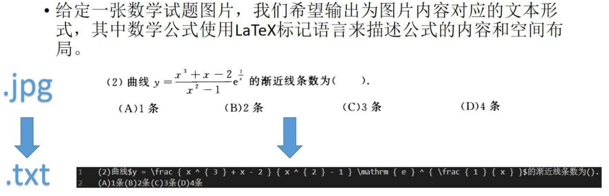
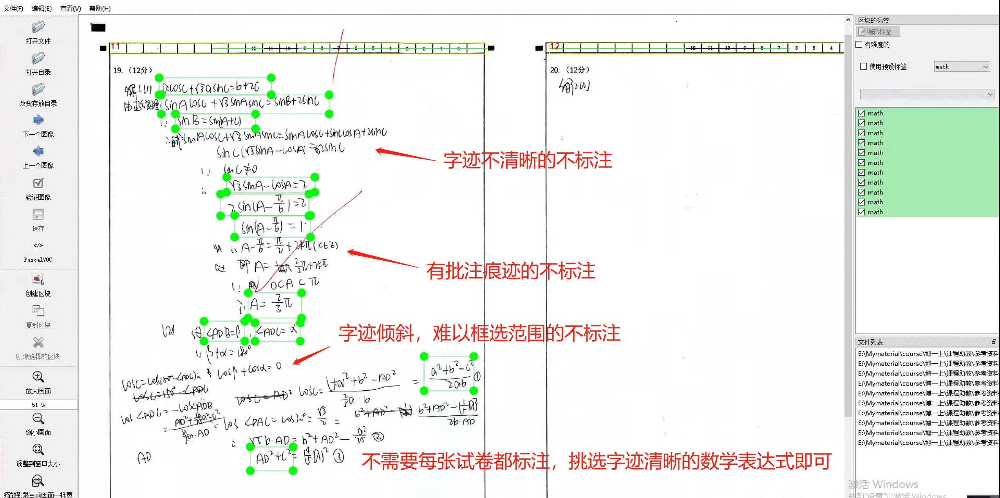
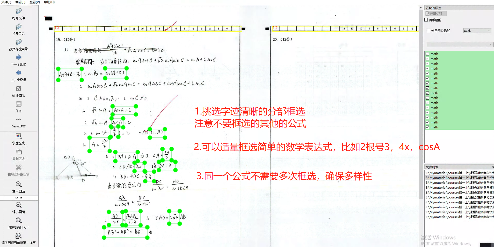
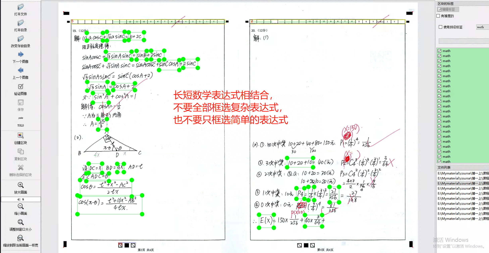
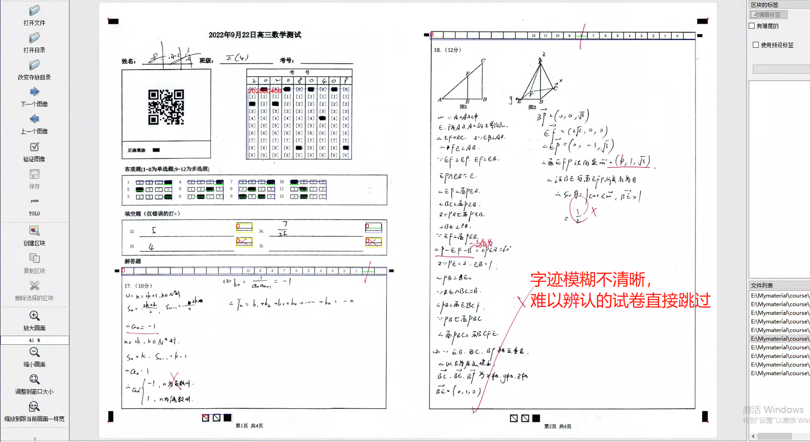
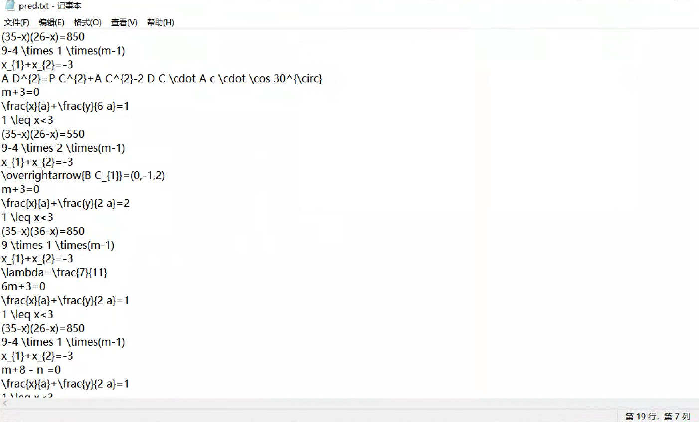

# 手写公式识别项目


## 一. 项目概述

### 1.1 项目简介
实践是检验学习成果的重要环节。在之前的作业当中，同学们已经熟悉了深度学习的基本原理和Pytorch/TensorFlow框架的使用方法，但是之前的作业距离实际的开发或科研仍然相差甚远。
为了检验同学们的学习成果，期末的大作业将是以小组的形式开展（每组4~5人），目标是从数据标注开始，训练一个手写公式识别模型。
其中，步骤一是每位同学都需要完成的，后续的步骤请进行合理的分工。
最终的考核形式以**答辩为主**，并且需要每位同学提交实验报告和源代码。
实验代码等数据以组为单位上交，实验报告单独撰写，单独上交，注明分工内容。
相关代码见github仓库：https://github.com/zzz47zzz/deep-learning-course-documents


### 1.2 问题定义
需要把图片格式的**数学表达式**转化为文字格式的**LaTex表达式**
<div align="center">

</div>

如上图所示是将印刷体格式的数学表达式进行识别和转化，而我们这次项目聚焦的是手写体的数学表达式。
手写体比印刷体的识别难度更加大，目前还是一个挑战。

如图，需要识别成 "1-2 < x" 


### 1.3 评价指标

1. [EditDistance](https://www.jianshu.com/p/a617d20162cf)：即Levenshtein距离，以取反的百分数呈现，越大越好。例：80%的EditDistance代表需要改动20%的内容才能达到groundtruth
2. ExactMatch：当预测结果和gt一样时才算100%准确，否则为0%，因此同样越大越好。


### 1.4 完成内容

1. 熟悉并使用labelImg软件提取公式图片。本次实验会提供**真实的初高中数学试卷**作为数据源给每位同学，每位同学负责其中一部分图片的**公式框选**。（步骤一）
2. 待每位同学完成后，将会收集同学们框选的标注，通过[mathpix](https://mathpix.com/)识别后，**取mathpix的识别结果作为ground truth**，再发回给大家作为数据集来训练。（步骤二）
3. 下载获取数据集（步骤三）
4. 利用所提供的代码，完成数据的**清洗+预处理**工作，以便作为模型的输入。（步骤四）
5. 训练**两个模型**：（步骤五）
    - 模型1：Encoder用CNN，Decoder用RNN
    - 模型2：Encoder用Resnet，Decoder用[Transformer](https://arxiv.org/abs/1706.03762)
6. 提交模型测试集预测结果，获取测试集成绩（步骤六）
7. 准备**小组答辩**，同时提交**实验报告**和**源代码**。（步骤七）


### 1.5 评分标准（项目总体分值为100分）

1. 数据标注（40分）：**高质量完成**对应标注任务即可得到该部分分数的85%，**额外标注一份**即可得到得到该部分分数的100%。注：若标注质量低则酌情扣分。
2. 模型实现（50分，**结合答辩环节评估**）：
   - 模型正确性（30分）：模型1 CNN+RNN（15分）和 模型2 Resnet+Transformer（15分）。评分根据参考代码实现是否正确、实验结果评测指标、代码可复现性和注释等方面来考虑。
   - 模型拓展性（20分）：优化模型、优化数据预处理、讨论任务瓶颈等。有UI的根据UI的美观、实用性等方面酌情加分。
3. 实验报告（10分）：材料完整性，命名规范性，书写美观性等等。

**注：若发现代码，模型，结果，实验报告有抄袭或伪造情况，则扣除相应部分的分数！**


## 二，步骤一：标注数据

### 2.1 使用软件介绍

本次标注使用的是labelImg，是目标检查与识别科研界内广泛使用的开源标注软件。项目地址为：https://github.com/tzutalin/labelImg。


### 2.2 软件安装流程


1. 在windows系统下运行。首先下载仓库文件到本地，可以*手动下载zip压缩包后解压*或者*在目标路径下打开git bash并输入以下命令*
```
git clone https://github.com/heartexlabs/labelImg.git
```
2. 进入labelImg文件夹，打开cmd终端依次运行
```
pip3 install pyqt5 lxml
make qt5py3
python3 labelImg.py
```
注：如果遇到报错“'make' 不是内部或外部命令，也不是可运行的程序或批处理文件。”，解决方法：（1）参考[这里](https://www.jianshu.com/p/9bffbaf12bed)先安装MinGW；（2）参考[这里](https://blog.csdn.net/qq_43382350/article/details/105840862)打开MinGW管理界面安装toolkit等组件，最后在MinGW/bin路径下找到mingw32-make.exe并复制改名为make.exe。
<div align="center">

</div>
顺利执行*labelImg.py*后将自动打开标注软件如下图：
<div align="center">

</div>


### 2.3 标注流程

数据标注属于最基础且重要的工作，在真实的生产环境中，提高数据的质量往往比提高算法更加有效，因此企业常常花费大量的时间和经历做一些数据相关的工作。
此次的任务延续去年深度学习课程的传统，让同学们参与到一个可以落地的深度学习项目当中，不同在于今年比往年更近一步，需要识别手写体而不是印刷体，因此更加具有挑战。
此次标注过程一方面是为了搜集数据以便设计出更好的模型，另一方面也是让同学们亲身感受和参与数据标注的过程，本身工作量并不大，而且只要求框选出数学表达式，真正生成latex标注的工作会交给mathpix完成，所以希望大家用心完成标注任务，标注完成后会检查标注质量，若质量不合格则会会扣除一定的分数。
每位同学会分配60张的试卷图片（预计标注时长1h），需要额外标注的同学联系助教拿额外60张试卷图片，其他标注问题在群里面问助教。

1. 新建文件夹用于存放标注图片和对应的标签
在自定义的路径下新建*input_images*和*output_annotations*两个空文件夹。把所分配的数学试题图片放入*input_images*中。*output_annotations*文件夹用于存放后续软件生成的每张图片的xml标签。**待标注完成后重命名并提交*output_annotations*文件夹压缩包**
2. 在网址 http://202.38.247.12/ 下找到自己*点名册序号.zip*的图片压缩包下载，并把解压的图片放入*input_images*文件夹中。
3. 修改类别标签文件*labelImg/data/predefined_classes.txt*，删去原来类别名称，输入math，保存退出。
4. 在labelImg下，使用命令```python3 labelImg.py```打开标注软件（若在上一步中已经打开标注软件则跳过此步骤）
5. 点击打开目录(Open Dir)，选择*input_images*文件夹
6. 点击改变存放目录（Change Save Dir），选择*output_annotations*文件夹
7. 点击Yolo/Pascal切换到PascalVOC模式。
<div align="center">

</div>

8. 点击创建区块（快捷键w），圈出图片中的数学表达式（框选规则见下一节），选择标签选择math，按“OK”键完成一个框的标注。当完成当前图片所有框选后，使用快捷键ctrl+S保存，当前图片的标注将自动保存到*output_annotations*文件夹下。之后点击下一张图片（下一张图片快捷键d，上一张图片快捷键a），重复以上过程直到完成预定数量的标注。
注：检查*output_annotations*文件下是否生成同名的xml标注文件
<div align="center">

</div>

注：提升效率小技巧：（1）熟练使用快捷键w和d；（2）在软件右上角勾选使用预设标签

9. 重命名*output_annotations*文件夹为*点名册序号_姓名*，压缩并在提交到指定网址 https://workspace.jianguoyun.com/inbox/collect/5f99cc9da86147c08b50bbae45e1e432/submitv2 。

### 2.4 框选数学表达式规则：

框选图片中所有清晰的数学表达式，这里的数学表达式指的是带有上下标字母、字母加数字、公式或者其他任何能够转化为latex形式的数学表达式，
标注的原则如下：
1. 认真框选每一个数学表达式，**根据标注质量**评判此部分的分数。
2. 框选**字迹清晰**，**水平方向书写**，**不受批注痕迹影响**的数学表达式。
3. 只有数字或简单字母的不框（比如*5*或*a*），但是组合的数学表达式比如*5a*可以框选。
4. 难易相结合，长短相结合。
5. 不同位置重复的表达式不框选。
6. 题号等无关作答内容的数学表达式不框选。
7. 跳过字迹不清晰的试卷。

以下是一些框选的示例：

<div align="center">




</div>


## 三，步骤二：利用mathpix生成标注图片对应的公式
此步无需同学们完成。

## 四，步骤三：获取数据集
在网址 http://202.38.247.12/ 下载数据集，由于数据集未正式公开，目前仅用作课程作业，请勿传播。
格式和说明如下：
```
.
└── datasets
    ├── train           # 训练集：用于模型训练
    |   ├── images      # 训练集图片
    |   └── labels      # 训练集标签
    ├── dev             # 验证集：用于调试参数
    |    ├── images     # 验证集图片
    |    └── labels     # 验证集标签
    ├── test            # 测试集：用于检验模型泛化能力
    |    └── images     # 测试集图片
    ├── train_ids.txt   # 训练集的图片，标签名称(id)
    ├── dev_ids.txt     # 验证集的图片，标签名称(id)
    └── test_ids.txt    # 测试集的图片，标签名称(id)
```

## 五，步骤四：数据预处理（data_preprocess文件夹）

### 5.1 项目文件功能
```
.
├── data_filter.py # 过滤多行和内容为error mathpix的标签
├── data_preprocess_for_im2latex.py    # 将数据整理成im2latex这个项目需要的格式
├── extract_image_according_to_label_list.py    # 根据有效标签提取对应图片（一般来说有效标签数小于图片数，这一步是在预处理阶段将两个文件夹对齐，当然你也可以在模型的data_loader阶段对齐，总之以标签文件为锚点，不要出现根据图片去找标签这个情况，因为可能找不到。）
├── no_chinese.py   # 这个文件非常重要，首先根据vocab（vocab关键词不完整，欢迎大家人工添加）进行分词，再过滤不在词表的标签文件
├── pad_image.py    # 做图片padding的
├── shuffle_and_build_dataset.py    # 针对LaTeX_OCR_PRO这个项目的格式预处理
├── vocab.txt
└── write_matching.py
```


### 5.2 预处理思路 
1. Tokenization，根据词表进行分词，并根据词表初步过滤数据
2. 过滤多行数据和error mathpix
3. 对齐过滤后的数据
4. 根据项目输入输出格式对数据进行最后的调整
5. 根据神经网络模型的需要，看是否需要padding，padding到什么size


## 六，步骤五：训练和评估模型

- 模型1：Encoder用CNN，Decoder用RNN：[参考GitHub地址](https://github.com/LinXueyuanStdio/LaTeX_OCR_PRO)。另外，近年来通过在Encoder和Decoder之间添加注意力机制能大大提升模型的效果，参考[https://arxiv.org/abs/1609.04938v1](https://arxiv.org/abs/1609.04938v1)，若添加有注意力与无注意力的对比分析可酌情加分。
- 模型2：Encoder用Resnet，Decoder用[Transformer](https://arxiv.org/abs/1706.03762)：[参考GitHub地址](https://github.com/kingyiusuen/image-to-latex)。


## 七，步骤六：测试模型

### 7.1 评估概述
- 是否必须：非强制，是否测试及测试成绩会作为打分参考
- 开放时段：11月18日~11月24日
- 提交限制：每组每种模型两阶段**各一次**
- 提交形式：坚果云链接（见6.2）
- 提交内容：提交**一个TXT格式文件**包含模型在测试集上的预测结果（见6.3）
- 评价指标：BLEU Score, Edit Distance Score（见6.4）
- 测试结果：测试结果和排名将会**在每一阶段提交结束后次日公布**
- 注意事项：
  1. 只交一个TXT文件！
  2. 顺序不要错，一定要和test_ids.txt的顺序一一对应！
  3. 同组同模型重复提交会覆盖！
  4. 预测TXT文件严禁传播！
  5. 各组妥善保存对应模型参数以备查验！

### 7.2 两阶段测试
- 第一阶段测试：11月18日00:00:00开放提交，11月20日23:59:59停止提交。提交链接：https://workspace.jianguoyun.com/inbox/collect/2b794216f3e54dc68b4f54a7358b2f2e/submitv2
- 第二阶段测试：11月22日00:00:00开放提交，11月24日23:59:59停止提交。提交链接：https://workspace.jianguoyun.com/inbox/collect/f5a21832a8824e209bb83db81085ca4a/submitv2

### 7.3 提交内容（一个TXT格式文件）
数据集目录下的test_ids.txt中包含了测试集的图片id，每一行为一张测试图片的id（即测试集中名称为{id}.jpg或{id}.png的图片）。
所需提交的TXT文件中，每一行表示test_ids.txt相应行对应测试图片的预测结果。
一个提交示例如图：
<div align="center">

</div>

### 7.4 评价指标：
1. BLEU Score (0~100; larger is better)
```
from nltk.translate.bleu_score import sentence_bleu
bleu_score = 0.0
for i,j in zip(references,hypotheses):
    bleu_score += max(sentence_bleu([i],j),0.01)
bleu_score = bleu_score/len(references)*100
```

2. Edit Distance Score (0~100; larger is better)
```
def edit_distance(references, hypotheses):
    """Computes Levenshtein distance between two sequences.
    Args:
        references: list of sentences (one hypothesis)
        hypotheses: list of sentences (one hypothesis)
    Returns:
        1 - levenshtein distance: (higher is better, 1 is perfect)
    """
    d_leven, len_tot = 0, 0
    for ref, hypo in zip(references, hypotheses):
        d_leven += distance.levenshtein(ref, hypo)
        len_tot += float(max(len(ref), len(hypo)))

    return (1. - d_leven/len_tot)*100
```

## 八，步骤七：准备答辩和提交材料

### 8.1 答辩
- 时间：11月26日
- 地点：待定
- 时长：约5分钟
- 准备：PPT，实验报告，源代码等辅助材料

### 8.2 提交材料
- 截止时间：待定
- 提交形式：待定
- 提交格式：每位同学一个压缩包**序号_姓名.zip**，结构如下
```
.
└── 序号_姓名文件夹
    ├── 实验报告 # .docx/.doc/.pdf
    ├── 源代码（可选；提交个人负责部分的代码）# 文件夹/.zip
    └── 其他（可选；实验报告里面涉及的辅助材料） # 文件夹/.zip
```
- 其他注意事项：不要交训练数据，实验报告里明确分工，不要只粘贴代码，有问题在群里或者私聊问助教或者线下问老师
